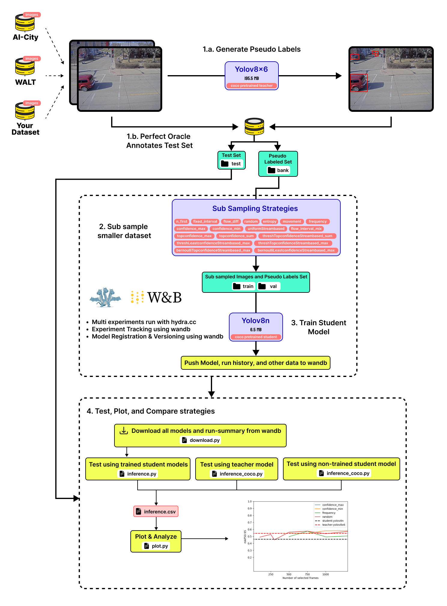
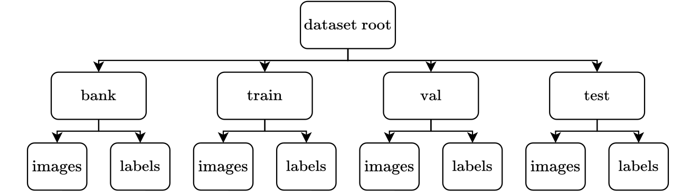

# Clustered Stream-Based Active Distillation for Scalable Model Deployment

This project introduces a novel approach to model distillation, leveraging stream-based active learning for efficient and scalable deployment across diverse datasets. Our methodology is detailed in our [paper](https://openaccess.thecvf.com/content/CVPR2023W/L3D-IVU/papers/Manjah_Stream-Based_Active_Distillation_for_Scalable_Model_Deployment_CVPRW_2023_paper.pdf), with practical applications demonstrated through the WALT dataset.



## Table of Contents
- [Prerequisites](#prerequisites)
- [Installation](#installation)
- [Datasets](#datasets)
- [Getting Started](#getting-started)
- [Configuration](#configuration)
- [Testing](#testing)
- [FAQs](#faqs)


---

## Prerequisites <a name="prerequisites"></a>
Before beginning the installation process, ensure you have:
- A Linux 20.04 system.
- An active [wandb](https://wandb.ai/) account for experiment tracking.
- Conda or virtualenv prepared on your machine.
- Videos dataset split according to the Dataset section of at least 5000 samples per image


## Installation <a name="installation"></a>

The code was developed under Linux 20.04. 

### Setup your virtual environment 

We recommend working in a virtualenv or conda environment.

```bash
conda create -y --name CSBAD python pip
conda activate CSBAD
```
### Requirements

To reproduce the results, you need to install the requirements of the YOLOv8 framework AND:

```bash
cd ..
pip install -r requirements.txt
```
### Configure wandb

We use wandb to log all experimentations. You can either use your own account, or create a team. Either way, you will need to login and setup an entity to push logs and model versions to.

1. Create a [wandb](https://wandb.ai/) entity
2. Setup wandb to send logs :

```bash
wandb login
```


## Datasets <a name="datasets"></a>

Required dataset structure :



Modifications to this structure are permissible but require appropriate configuration adjustments.

Ensure your dataset adheres to the following structure:

Dataset
├── cam{1}
│   ├── week{1}
│   │   └── bank
│   │   │   ├── images
│   │   │   └── labels_${STUDENT-MODEL}_w_conf 
        |   └── labels_${TEACHER-MODEL} 
|   |   └── test
│   │       ├── images
│   │       └── labels
.   .
│   └── week{i}
│       └── ...
.
└── cam{j}
    └── ...
```

## 3. Getting Started <a name="getting-started"></a>

### Generation of the pseudo labels (populate bank)

To generate the pseudo labels, execute the following command:

```bash
python generate_pseudo_labels.py --folder "YOURPATH/WALT"

OPTIONS:
--extension "jpg" or "png"
--model-name "yolov8n, yolov8s, yolov8m, yolov8l, yolov8x6" or any custom model
--output-conf # Produce labels with confidence, useful for confidence_based strategies

```
*Note:* The 'bank' folder must contain an 'images' folder with all the images. If you are on Windows, only use `"` and **not** `'`.

### Conduct an Experiment

Before conducting an experiment, ensure your wandb entity and the project are correctly set up in the `experiments/model/yolov8.yaml` Hydra config file.

To conduct an experiment, follow these steps:

1. Populate a `val` folder based on the data contained in the bank folder.
2. Populate a `train` folder based on a `strategy` applied on the data contained in the bank folder. The `strategy` ensures that no images are duplicated between the train and the val sets.
3. Launch a training on a `yolov8n` model based on the previously generated sets. The scripts automatically launch everything to wandb.

You can launch an experiment by executing the main script:

```bash
python train.py
```

In case of debugging, you can add `HYDRA_FULL_ERROR=1` as an environment variable to see the traceback more clearly.

```bash
HYDRA_FULL_ERROR=1 python train.py
```

#### Modify the configs to change the experiments
Hydra is a configuration management tool that retrieves the information included in the `*.yaml` files to facilitate the deployment of the application.

To modify an experiment you can modify the configuration file `experiments/experiment.yaml`. **At your first use, you will have to modify the paths to the dataset and your wandb username.**

You need to modify 
1. experiments/model/yolov8.yaml (WANDB entity)
2. experiments/experiment.yaml (Insert your data folder)
The logs and outputs of the runs are stored in the `output` folder.

*remark*: if you are using Windows, do not forget to adapt your paths by using `/` instead of **not** `\` or `//`.

>**IMPORTANT !**
>
> We use a specific run naming format to track the experiments in wandb and run testing. We do that using the name attribute in the dataset config file. Look at `experiments/dataset/WALT.yaml` for an example.
> NAMING CONVENTION: {Source_domain}_{Target_domain}_{Student}_{Teacher}_{Strategy}>_{Active-Learning-Setting}_{Total_Samples}{Iteration_Level}_{Epochs}_> >_{Validation_Set} Finer-granularity can be expected as {Source_domain} = {dataset}->{domain}-{period}
 

#### Configure a particular training 


python train.py --multirun n_samples=300 cam=1o2o3 week=1o1o5 strategy=thresh-top-confidence student=yolov8n teacher=yolov8m

This will train by sampling 100 samples from camera 1,2,3 using thresh-top-confindence based on the student_yolov8n confidence. The teacher model generates afterwards a yolov8x6 teacher. 


## 4. Testing <a name="testing"></a>

You can use the download to get all the models of a specific project from wandb. Then you use the inference tool to test the models on the dataset. Finally use the inference_coco tool to generate the same testing metrics for the student and teacher models. All the testing results are concatenated in a single file.

We have created a `test.py` file that executes all of these steps in a single command.

```
python test.py --run-prefix WALT --entity YourEntity --project WALT --template testing/templates/WALT.yaml --dataset_path "YOURPATH/WALT/"
```

Flags :
- `--entity` : wandb project team
- `--project` : wandb project name
- `--run-prefix` : project name used as prefix in the runs names (sometimes it's different than the wandb project name, like in the case of "study")
- `--template` : template file for data.yaml used to specify test "sub" datasets
- `--dataset_path` : parent path containing all dataset folders (camX in case of WALT) 
- `--query_filter` : you can choose to download and test only specific models by filtering through characters or words in the run names.
- `--wandb-download` : you can set this to false, if you would like to run all testing pipeline without the download script


Results will be in `testdir/project` where you'll find : 
1. `wandb` folder containing downloaded weights. 
2. `inference_results.csv` file containing inference results
3. `plots` folder containing generated plots for each metric in the inference results (To modify plots look in `testing/plot.py`)

You can also run each script/tool individually :

1. Download models :
```
python testing/download.py -e YourEntity -p WALT -f ./testdir/WALT/wandb -lf -d
```

2. Test downloaded models on the test set :
```
python3 ./testing/inference.py -w ./testing/WALT/wandb -d "YOURPATH/WALT/" -p WALT -y testing/templates/WALT.yaml -f test -c ./testdir/WALT/inference_results.csv
```

3. Test pretrained Student and Teacher models on dataset :
```
python3 testing/inference_coco.py --model yolov8n --csv_path ./testdir/WALT/inference_results.csv --dataset "s05c016->"YOURPATH/WALT/s05c016/" --dataset--data-template testing/templates/Ai-city.yaml --folder test
```

4. Plot graphs :
```
python testing/plot.py --csv_path ./testdir/WALT/inference_results.csv --save_path ./testdir/Ai-city/plots
```

Use the `--help` flag for more information on the usage of each script.


## ANNEX  - MATERIALS - Test Set Details for the WALT Dataset

Below is a summary of the test set details for the WALT dataset, including image count, size, and links to access each camera's test set on Roboflow. To access the dataset, append the specified path to this preamble: `https://universe.roboflow.com/sbad-dvvax`.

| CAM | SAMPLES | INSTANCES | IMG SIZE  | ROBOFLOW Link |
|-----|---------|-----------|-----------|---------------|
| 1   | 300     | 2133      | 4000x3000 | [sbad_cam1_test_set/dataset/3](https://universe.roboflow.com/sbad-dvvax/sbad_cam1_test_set/dataset/3) |
| 2   | 300     | 1252      | 2000x1500 | [sbad_cam2_test_set/dataset/1](https://universe.roboflow.com/sbad-dvvax/sbad_cam2_test_set/dataset/1) |
| 3   | 300     | 1475      | 4000x3000 | [sbad_cam3_test_set/dataset/1](https://universe.roboflow.com/sbad-dvvax/sbad_cam3_test_set/dataset/1) |
| 4   | 50      | 267       | 2048x2048 | [sbad_cam4_test_set/dataset/1](https://universe.roboflow.com/sbad-dvvax/sbad_cam4_test_set/dataset/1) |
| 5   | 300     | 210       | 990x990   | [sbad_cam5_test_set/dataset/1](https://universe.roboflow.com/sbad-dvvax/sbad_cam5_test_set/dataset/1) |
| 6   | 100     | 1027      | 990x990   | [sbad_cam6_test_set/dataset/1](https://universe.roboflow.com/sbad-dvvax/sbad_cam6_test_set/dataset/1) |
| 7   | 100     | 2709      | 990x990   | [sbad_cam7_test_set/dataset/1](https://universe.roboflow.com/sbad-dvvax/sbad_cam7_test_set/dataset/1) |
| 8   | 100     | 992       | 990x990   | [sbad_cam8_test_set/dataset/2](https://universe.roboflow.com/sbad-dvvax/sbad_cam8_test_set/dataset/2) |
| 9   | 300     | 2512      | 4000x3000 | [sbad_cam9_test_set-akhti/dataset/1](https://universe.roboflow.com/sbad-dvvax/sbad_cam9_test_set-akhti/dataset/1) |